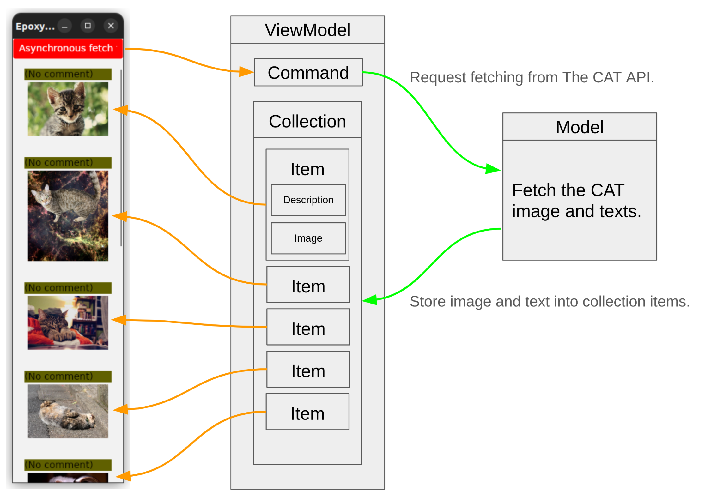

# Epoxy - 簡単・シンプル・最小限のマルチプラットフォームMVVMライブラリ


[English language is here](https://github.com/kekyo/Epoxy)

[](https://www.repostatus.org/#wip)

## NuGetパッケージ (C#)

|Package|main|Description|
|:--|:--|:--|
|Epoxy.Wpf|[](https://www.nuget.org/packages/Epoxy.Wpf)|WPF version|
|Epoxy.Avalonia11|[](https://www.nuget.org/packages/Epoxy.Avalonia11)|Avalonia version 11|
|Epoxy.Avalonia|[](https://www.nuget.org/packages/Epoxy.Avalonia)|Avalonia version|
|Epoxy.OpenSilver|[](https://www.nuget.org/packages/Epoxy.OpenSilver)|OpenSilver version|
|Epoxy.Maui|[](https://www.nuget.org/packages/Epoxy.Maui)|.NET MAUI version|

## NuGetパッケージ F#専用

|Package|main|Description|
|:--|:--|:--|
|FSharp.Epoxy.Wpf|[](https://www.nuget.org/packages/FSharp.Epoxy.Wpf)|WPF version|
|FSharp.Epoxy.Avalonia11|[](https://www.nuget.org/packages/FSharp.Epoxy.Avalonia11)|Avalonia version 11|
|FSharp.Epoxy.Avalonia|[](https://www.nuget.org/packages/FSharp.Epoxy.Avalonia)|Avalonia version|

## これは何?

あなたは、XAMLを使用するGUIアプリケーションを作ったことはありますか？ WPFから始まり、現在では、Avalonia, OpenSilver, MAUIなど、様々なXAMLプラットフォームが存在します。

これらのXAMLプラットフォームでは、特にMVVM (Model-View-ViewModel) アーキテクチャを併用することが推奨されているのですが、MVVMには解釈の違いによる方言も多く、また完全に統一された強固なアーキテクチャでもないため、実装しようとすると困難に直面することがあります。

Epoxyは、MVVMをアーキテクチャではなく、一種の道具として捉え、学習曲線を緩やかにして、MVVMビギナーへの理解の助けや導入の容易さ、簡単でありながら独立性が高く再利用のしやすい機能群となるように設計しました。

もちろん、Epoxyは初心者専用のライブラリというわけではありません。シンプルであるということは、様々な環境でも柔軟で応用性があるということです。（非公開ではありますが、Epoxyは複数の業務利用実績があります。）

以下に、Epoxyの特徴を示します:

* C#を含む.NETの全処理系向け、及びF#用のNuGetパッケージがあります。
* 以下の環境をサポートしています:
  * WPF: .NET 8.0/7.0/6.0/5.0, .NET Core 3.0/3.1, .NET Framework 4.5/4.8
  * Avalonia: [Avalonia](https://avaloniaui.net/) (New v11 or 0.10 series)
  * OpenSilver: [OpenSilver](https://opensilver.net/) (1.0.0 or higher)
  * .NET MAUI: 7.0 or higher
* 非同期処理 (async-await) を安全に書くことが出来るように配慮しています。
* C# 8.0でサポートされた、null許容参照型を使えます。
* F#は5.0以降に対応しています。F#向けのシグネチャ (camel case functions・関数型・Async型前提) が定義されています。
* 小さなライブラリで、理解しやすいAPIです。
  * プラットフォーム標準以外のフレームワークやライブラリに依存していません。
* 大げさにならない、最小の手間とコストで Model-View-ViewModel 設計を実現します。
  * Viewにコードビハインドを書かずに済むことが着地点ですが、そのために煩雑な処理を記述しなければならなくなる事を避ける方針です。
  * MVVMビギナーが躓きそうな部分に焦点を当てています。
  * 完全な共通化は行いません。Epoxyについてだけ同じように記述可能にし、その他の部分はそれぞれの環境に依存させることで、機能が最大公約数的にならないようにしています。
  * それぞれの機能が、相互に関係「しません」。独立しているので、自由に組み合わせることが出来ます。
* ほかのフレームワークライブラリ(例: ReactiveProperty)と組み合わせて使えるように、余計な操作や暗黙の前提を排除しています。

## 導入方法

ターゲットとなるGUIフレームワークに対応したNuGetパッケージを導入してください。
Epoxyパッケージは沢山公開されていますが、必要なのは、あなたが使っているXAMLプラットフォームに対応する、以下の特定のパッケージのみです:

* `Epoxy.Avalonia11`
* `Epoxy.Avalonia`
* `Epoxy.WPF`
* `Epoxy.OpenSilver`
* `Epoxy.MAUI`
* `FSharp.Epoxy.Avalonia11`
* `FSharp.Epoxy.Avalonia`
* `FSharp.Epoxy.WPF`

他に `Epoxy.Core.WPF`や`Epoxy.Build`と言ったパッケージが見つかるかもしれませんが、
これらは上記のパッケージから依存して自動的に使用されます。

注意: `Epoxy.Templates`には、テンプレートプロジェクト定義が含まれていましたが、1.15.0から廃止されました。これに伴い、Visual Studioのテンプレートウィザードも廃止されています。大丈夫です、ウィザードに頼らなくても、Epoxyは簡単に使い始めることができます！

フルスクラッチでEpoxyを導入したい、あるいは既存のプロジェクトにEpoxyを導入したい場合は、
[ステップバイステップでコミットを作成した、Avalonia 11のサンプルリポジトリ](https://github.com/kekyo/Epoxy.Avalonia11.SampleProject) が役に立つかもしれません。


----

## サンプルコード

様々な環境の実働サンプルがあります。

起動後にボタンをクリックすると、The Cat APIから、最新の投稿記事と画像を非同期でダウンロードしながら、
リスト形式で表示するものです。


サンプルコードプロジェクトは、[playgroundディレクトリ](playground/) 、又はF#のサンプルコードは [playground.FSharpディレクトリ](playground.FSharp/) 
にあります。

### 解説動画があります (YouTube, 日本語のみ):

[](https://www.youtube.com/watch?v=LkyrgJbuiQs)

[(再生出来ない場合はこちら)](https://www.youtube.com/watch?v=LkyrgJbuiQs)


----

## MVVMアプリケーションの実装を、最小限の手間で始める

いますぐEpoxyの具体的な機能を確認したい場合は、 [機能一覧](#機能一覧)を参照してください。
ここでは、Model-View-ViewModelのそれぞれの役割について、おさらいします:

* `View`: XAMLでユーザーインターフェイスを記述し、`ViewModel`とバインディングする（コードビハインドを書かない）。
* `ViewModel`: `Model`から情報を取得して、`View`にマッピングするプロパティを定義する。
* `Model`: ユーザーインターフェイスに直接関係の無い処理を実装。ここではThe Cat APIから猫情報をダウンロードする処理。

以下にこれらのMVVM要素の関係を図示します:


注意: MVVMの役割については諸説あります。
はじめから完全な設計を目指さずに、ブラッシュアップすると良いでしょう。
Epoxyは段階的に改善する事を想定して設計しています。

XAMLビューの定義とその実装を、MVVMに従って完全に分離しつつ、最小限の手間で実装する例を示します。前節の、The CAT APIを使用する例です。
(このコードはWPFの例で、ポイントとなる点に絞っているため、完全な例はサンプルコードを参照して下さい):

### View (WPF XAML)の実装例

MVVMのViewとは、表示の見た目や構造をXAMLで定義します。ここには、動的な制御処理は記述しません。各コントロールの配置、色、フォントなどが含まれます。

`ListBox`コントロールは、複数の同じ見た目を持つ項目群を並べて表示する機能があります。 

```xml
<Window
    x:Class="EpoxyHello.Wpf.Views.MainWindow"
    xmlns="http://schemas.microsoft.com/winfx/2006/xaml/presentation"
    viewmodels="clr-namespace:EpoxyHello.Wpf.ViewModels"
    Title="EpoxyHello.Wpf" Height="450" Width="800">

    <!-- ここに、ViewModelクラスのインスタンスを配置します。この定義によって、IDEがViewModelの型を認識できます。 -->
    <Window.DataContext>
        <viewmodels:MainWindowViewModel />
    </Window.DataContext>
    
    <DockPanel>
        <!-- ボタンのクリックイベントを、ViewModel側にバインディングで通知します。 -->
        <Button DockPanel.Dock="Top" Height="30"
                Command="{Binding Fetch}">Asynchronous fetch the cats from The Cat API!</Button>
        <Grid>
            <!-- ListBoxに、ダウンロードした記事を保持するViewModelのコレクションをバインディングします。 -->
            <ListBox ItemsSource="{Binding Items}"
                ScrollViewer.HorizontalScrollBarVisibility="Disabled"
                ScrollViewer.VerticalScrollBarVisibility="Auto"
                ScrollViewer.CanContentScroll="False">
                <ListBox.ItemTemplate>
                    <DataTemplate>
                        <!-- ダウンロードした記事のイメージを表示します。 -->
                        <Image
                            Source="{Binding Image}"
                            Stretch="UniformToFill" />
                    </DataTemplate>
                </ListBox.ItemTemplate>
            </ListBox>
        </Grid>
    </DockPanel>
</Window>
```

### ViewModel (WPF)の実装例

ViewModelの役割は、XAMLで定義された各コントロールを制御するコードを記述して、動的な振る舞いを持たせることです。

かつてのWindows Formsのように、なぜViewとViewModelの実装を一体化させないのか？という疑問には、さまざまな理由がありますが、現実的な問題として、 `ListBox` のような複数の要素に対して異なる内容を表示したり制御するのに、コードだけで実現するのは困難だからです。

これを解決するために、データバインディングと呼ばれる機能があり、データバインディングで問題を解決するために、MVVMというアーキテクチャが考案されたと言っていいでしょう。

`ListBox` の例で言うなら、ViewModelに定義されている `Items` コレクションの内容が、1対1で表示の各要素に対応するように、自動的に表示が更新されます。したがって:

* View側は各要素をどのように表示するか。配置や色やフォント、画像やその加工などをXAMLで指定する。
* ViewModel側は、各要素を追加、削除、あるいは順序の入れ替え、テキスト文字列や画像データの生成を行う。

ことに集中することができます。



以下は、表示と制御が完全に分離された、ViewModelクラスの実装です。
完全に分離、とは、つまりViewクラスに、コードビハインドを一切記述しないことを指します。

```csharp
using Epoxy;

// ステップ 1: ViewModelクラスを作ります。そしてViewModel属性を付与します。
//    この属性は、PropertyChangedを自動的に実装して、XAML側に伝搬できるようにします。
[ViewModel]
public sealed class MainWindowViewModel
{
    // ステップ 2: XAMLから参照したいプロパティを自動実装プロパティで定義します。
    //    Epoxyは、 C# 8.0 で追加された、null許容参照型定義に対応しています。
    public Command? Fetch { get; }
    public ObservableCollection<ImageSource>? Items { get; }

    // ViewModelのコンストラクタ
    public MainWindowViewModel()
    {
        // ステップ 3: プロパティのsetterが呼び出されると、
        //    PropertyChangedイベントが発生して、XAML側に変更が通知されます。
        this.Items = new ObservableCollection<ItemViewModel>();

        // ステップ 4: XAMLで定義したボタンがクリックされた時に、このラムダ式が呼び出されます。
        //   この式はもちろん async-await を使用した非同期処理で書くことが出来て、
        //   未処理の例外も正しく処理されます。
        this.Fetch = Command.Factory.Create(async () =>
        {
            var cats = await TheCatAPI.FetchTheCatsAsync(10);

            this.Items.Clear();

            foreach (var cat in cats)
            {
                if (cat.Url is { } url)
                {
                    var bitmap = new WriteableBitmap(
                        BitmapFrame.Create(new MemoryStream(await TheCatAPI.FetchImageAsync(url))));
                    bitmap.Freeze();
                    this.Items.Add(bitmap);
                }
            }
        });
    }
}
```

### Modelの実装例

The Cat APIにアクセスする共通コードは、`EpoxyHello.Core` プロジェクトで実装しています。
このプロジェクトは、WPF・Avalonia・OpenSilver・MAUIのいずれにも依存せず、完全に独立しています。

このように、依存性を排除することで、マルチプラットフォーム対応の共通化を行うことが出来ますが、
小規模な開発であれば、`Model`の実装を`ViewModel`と同じプロジェクトに配置してもかまいません
(分離しておけば、意図せず依存してしまったという失敗を排除出来ます)。

[投稿画像をダウンロードする部分 (playground/EpoxyHello.Core)](https://github.com/kekyo/Epoxy/blob/main/playground/EpoxyHello.Core/Models/TheCatAPI.cs#L55)を抜粋します:

```csharp
// Modelの実装: netstandard2.0の純粋なライブラリ
// The Cat APIから画像をダウンロードする
public static async ValueTask<byte[]> FetchImageAsync(Uri url)
{
    using (var response =
        await httpClient.GetAsync(url).ConfigureAwait(false))
    {
        using (var stream =
            await response.Content.ReadAsStreamAsync().ConfigureAwait(false))
        {
            var ms = new MemoryStream();
            await stream.CopyToAsync(ms).ConfigureAwait(false);
            return ms.ToArray();
        }
    }
}
```

Modelの実装は、直接ユーザーインターフェイスを操作する事がないため、
非同期操作でタスクコンテキストを分離 `task.ConfigureAwait(false)` することで、
パフォーマンスを向上させることが出来ます。


----

## 機能一覧

以下に、Epoxyの機能の一覧を示します。Epoxyのそれぞれの機能は独立しているため、自由に組み合わせて使用出来ます（例えば、ViewModelにありがちな、基底クラスの継承は必須ではありません）。

|機能名|概要|
|:----|:----|
|ViewModelインジェクタ|ViewModelに必要なPropertyChangedイベントなどを、ビルド時に自動的に実装出来る機能です。対象のクラスに属性を適用するだけで、煩雑なコードの実装を省略出来ます。|
|ViewModel基底クラス|ViewModelに必要なPropertyChangedイベントなどを、オーソドックスな基底クラスとして提供します。ViewModelインジェクタが適さないシナリオで、使用することが出来ます。|
|Command factory|任意の非同期デリゲートを、ICommandとして利用できるようにします。非同期処理を安全にICommandとして実装出来ます。|
|Fountain/Well|任意のXAMLコントロールのイベントを、バインディング可能にする添付プロパティです。イベントハンドリングを簡単かつ安全にバインディング出来ます。|
|EventBinder|任意のXAMLコントロールのCLRイベントを、ICommandとしてバインディング可能にする添付プロパティです。Commandプロパティが提供されていない任意のイベントを、安全にバインディング出来ます。|
|Anchor/Pile|任意のXAMLコントロールを、一時的かつ安全にViewModelから参照出来るようにします。Anchor/Pileを使用すると、全てのコードビハインドを排除出来るため、MVVMを使用する場合の実装の見通しが良くなります。Messengerパターンとして知られたテクニックも、Anchor/PileでViewModelに集約することが出来ます。|
|ValueConverter|XAMLの値コンバーターの基底クラスを提供します。事前に型判定が行われ、型制約がある状態で実装することが出来ます。|
|UIThread|UIスレッドの扱いを、プラットフォーム間で統一出来ます。また、非同期操作の継続として扱えるため、async-awaitやF#の非同期ワークフローで、シームレスにスレッドを扱うことが出来ます。|
|GlobalService|コンパクトな、依存注入のためのインフラです。非常に高速で単純なため、多くのシナリオに適し、プラットフォーム間で実装方法を統一出来ます。|
|Designer|デザイン時編集をサポートします。|

以下の解説には細かく記載していませんが、Epoxyの機能全体に渡って、非同期処理を考慮した設計となっています。

* メソッドのシグネチャは、原則として非同期(`ValueTask`の返却)を使用します。
* 誤用の可能性のあるオーバーロードは存在しないか、又は`Epoxy.Synchronized`名前空間内にのみ、配置されています。
* `Task`を使用するオーバーロードは、`Epoxy.Supplemental`名前空間に分離されています。これは、誤って`ValueTask`の代わりに`Task`を使用してしまう可能性を減らすためです。

----

### ViewModelインジェクタとViewModel基底クラス

`ViewModel`属性が適用されると、コンパイル時に自動的に`PropertyChanging`、`PropertyChanged`が実装されます。また、自動実装プロパティのsetterで、これらのイベントが自動的に発生するように処理されます。この機能を、`ViewModelインジェクタ`と呼びます。

以前のEpoxy(<0.15)の実装では、`ViewModel`基底クラスから継承する事を強制していましたが、この属性を使用することで、任意のクラスを負担なしでViewModelにすることが出来ます。

また、プロパティに`IgnoreInject`属性を適用すると、そのプロパティは`PropertyChanging`、`PropertyChanged`の処理対象から除外出来ます。

次のようなシグネチャのメソッドを併設することで、プロパティ変更時の処理を簡単に追加出来ます:

```csharp
// 定義したプロパティ
public string Title { get; set; }

// プロパティが変更された場合に呼び出される。
// シグネチャは強制されないので、以下の条件を守る必要がある:
// * 引数は、プロパティと同じ型 (引数名は任意)
// * 戻り値はValueTaskでなければならない
// * PropertyChanged属性を適用する。引数にプロパティ名を指定する（メソッド名は自由）
//   * PropertyChanged属性を使わない場合は、メソッド名を、"On<プロパティ名>ChangedAsync"とする
[PropertyChanged(nameof(Title))]
private ValueTask TitleChangedAsync(string value)
{
  // 値が変更された場合の処理...
}
```

`ViewModelインジェクタ`を使わず、従来通り`ViewModel`基底クラスを派生して実装することも出来ます。

`ViewModel`基底クラスは、`GetValue`/`SetValue`メソッドの実装を提供します。
これらのメソッドは、XAML側にプロパティの変更通知 `PropertyChanging`/`PropertyChanged` を自動的に行います。
たとえば、ボタンクリックの契機で`ViewModel`からプロパティを変更すると、変更がXAMLのコントロールに通知され、ユーザーインターフェイスに反映されます。

なお、`GetValue`には、デフォルト値の定義が、
`SetValue`には、値変更時に追加操作を行うことが出来るオーバーロードが定義されています。

プロジェクト内で全くViewModelインジェクタを使用しない場合は、
ViewModelインジェクタを無効化する事で、自動的なコードを解析を停止させ、ビルドを高速化出来ます。
csprojの`PropertyGroup`の`EpoxyBuildEnable`に`False`を指定して下さい。

----

### Fountain/Well

`Fountain`/`Well` は、後述の `EventBinder` に代わる、新しいイベントハンドリング機能です。

バインディング出来ないCLRイベントが公開されている場合に、
コードビハインドを一切記述しないで、ViewModel側で簡単にフック出来るようにします。
`RoutedEvent` にも対応しているため、あらゆるイベント処理を全く同じように記述できます。

また、コントロールが表示から切り離されると、イベントのアンフックも自動的に行われるため、
メモリリークを防ぐことが出来ます。

* `Fountain` とは、コントロールのイベントの発生源です。
* `Well` とは、 `Fountain` で発生したイベントを受信する場所で、 `Fountain` とはデータバインディングで結合します。
* イベントハンドラは、 `Well` に対して追加・削除します。

例えば、以下のように、WPFの `Window.Loaded` CLRイベントをバインディング出来ます。
イベントをフックしたいコントロールに、 `Fountain` 添付プロパティを配置してバインディングします:

```xml
<!-- EpoxyのXML名前空間を定義し、FountainをWellとバインディングする -->
<Window xmlns:epoxy="https://github.com/kekyo/Epoxy"
    epoxy:Fountain.Well="{Binding MainWindowWell}">

    <!-- ... -->
</Window>
```

`ViewModel` 側は、 `Well` を配置しておきます。
`Well` に対してイベント名を指定してハンドラを追加します:

```csharp
// Windowからのイベントを受信するWellを定義する
public Well<Window> MainWindowWell { get; } = Well.Factory.Create<Window>();

// ...

// Loadedイベントが発生した場合のハンドラをWellに追加
this.MainWindowWell.Add("Loaded", async () =>
{
    // リストに表示する情報をModelから非同期で取得
    foreach (var item in await Model.FetchInitialItemsAsync())
    {
        this.Items.Add(item);
    }
});
```

`Well.Add()`メソッドで、イベントに対応するハンドラデリゲートを登録します。
もちろんこのハンドラは、非同期処理対応です。

このメソッドには、イベント名を文字列で指定するオーバーロードと、`RoutedEvent`を指定するオーバーロードがあります。
`RoutedEvent`を指定するオーバーロードを使えば、いわゆる「添付イベント」を受信することも可能です:

```csharp
// ドラッグイベントが発生した場合のハンドラを追加
// (Avaloniaの場合、イベント引数eの型は自動的に決定されます)
this.MainWindowWell.Add(DragDrop.DragEnterEvent, async e =>
{
    // (ドラッグイベントの処理)
});
```

Avaloniaでは、 `RoutedEvent` からイベントの引数 `EventArgs` の型が供給されるため、
最も記述量が少なく、タイプセーフ性が維持されます。
それ以外の環境でイベント引数が必要な場合は、 `Well.Add<TEventArgs>(...)` のように、`EventArgs` 型を明示してください。

* MAUIには、`RoutedEvent`が存在しないため、Epoxyにもこの機能はありません。

一つの `Well` に対して、異なるイベントを同時に追加出来ます。
同じイベント名のハンドラは、同時に一つのみ追加可能です。

#### EventBinderからの移行

`EventBinder` も引き続きサポートされますが、`Fountain`/`Well`に移行すべきかどうか判断したい場合は、以下の表を参考にしてください。

|要素|利点|考慮事項|
|:----|:----|:----|
|XAML|記述量が圧倒的に少ない|いわゆるBehaviorとは構造が異なる|
|バインディング|`Well`をバインディング出来る|`ICommand`がバインディング出来ない|
|ViewModel|CLRイベントだけではなく、`RoutedEvent`もフック出来る。Avaloniaではハンドラ引数型が自動的に決定される|`ICommand`を使用していない|
|リフレクション|将来的にリフレクションフリーを実現する構造|現在はリフレクションを使用。`EventBinder`は常にリフレクションを使用。|

----

### EventBinder

注意:より便利な `Fountain`/`Well` 機能が追加されました。新規に使用する場合はそちらをお勧めします。

`EventBinder`は、バインディング出来ないイベントが公開されている場合に、`Command`としてバインディング可能にします。
この機能により、イベントハンドラを記述するために、やむを得ずコードビハインドを書くと言う手法を回避できます。

例えば、以下のように、WPFの`Window.Loaded`イベントをバインディング出来ます:

```xml
<!-- EpoxyのXML名前空間を定義します -->
<Window xmlns:epoxy="https://github.com/kekyo/Epoxy">

    <!-- ... -->

    <epoxy:EventBinder.Events>
        <!-- Window.Loadedイベントを、ViewModelのReadyプロパティにバインディングする -->
        <epoxy:Event EventName="Loaded" Command="{Binding Ready}" />
    </epoxy:EventBinder.Events>
</Window>
```

`ViewModel`側はButtonと同じように、Commandでハンドラを書くことが出来ます:

```csharp
// Loadedイベントを受信するためのCommandプロパティの定義
public Command Ready { get; private set; }

// ...

// Loadedイベントが発生した場合の処理を記述
this.Ready = Command.Factory.Create<EventArgs>(async _ =>
{
    // リストに表示する情報をModelから非同期で取得
    foreach (var item in await Model.FetchInitialItemsAsync())
    {
        this.Items.Add(item);
    }
});
```

`Command.Factory.Create<T>`のジェネリック引数には、イベントの第二引数(通常EventArgsを継承したクラス)を指定します。
イベントの引数が必要でない場合は、非ジェネリックメソッドを使う事も出来ます。

補足1: WPFやMAUIでは、`Behavior`や`Trigger`で同じことを実現できますが、
追加のパッケージが必要になることと、汎用的に設計されているため、やや複雑です。
`EventBinder`を使うことで、同じ記法でシンプルに記述できる利点があります。

補足2: UWP環境(MAUIのUWPビルドを含む)では、対象のイベントは以下のようなシグネチャである必要があります:

```csharp
// EventBinderでバインディング可能なイベント
public event RoutedEventHandler Loaded;
```

つまり、RoutedEventHandler型で公開されているイベントだけが対象です。
UWPの実行環境はセキュリティチェックが厳しいため、
動的にイベントをフックする場合に制約が存在するためです。

* [For example (In WPF XAML)](https://github.com/kekyo/Epoxy/blob/main/playground/EpoxyHello.Wpf/Views/MainWindow.xaml#L36)
* [For example (In WPF view model)](https://github.com/kekyo/Epoxy/blob/main/playground/EpoxyHello.Wpf/ViewModels/MainWindowViewModel.cs#L45)
* [For example (In Xamarin Forms XAML)](https://github.com/kekyo/Epoxy/blob/main/playground/EpoxyHello.Xamarin.Forms/EpoxyHello.Xamarin.Forms/Views/MainPage.xaml#L33)
* [For example (In Xamarin Forms view model)](https://github.com/kekyo/Epoxy/blob/main/playground/EpoxyHello.Xamarin.Forms/EpoxyHello.Xamarin.Forms/ViewModels/MainContentPageViewModel.cs#L40)

----

### Anchor/Pile

`Anchor`/`Pile`は、XAMLと`ViewModel`をゆるく結合して、XAML側のコントロールの完全な操作を、一時的に可能にします。

MVVMアーキテクチャのレアケースにおいて、コントロールを直接操作したくなることがままあります。
しかし、厳密に分離された`View`と`ViewModel`では、コードビハインドを書かないことが前提となるため、
このような連携が難しくなります。
また、オブジェクト参照の管理を誤るとメモリリークにつながり、かつ、その箇所を特定するのが難しくなります。

`Anchor`/`Pile`は、コントロールへの参照を一時的にレンタルすることによって、`View`と`ViewModel`を分離しながら、
この問題を解決します。もちろん、レンタル中の処理は非同期処理対応です。

```xml
<!-- EpoxyのXML名前空間を定義します -->
<Window xmlns:epoxy="https://github.com/kekyo/Epoxy">

    <!-- ... -->

    <!-- AnchorをTextBoxに配置してバインディングします -->
    <TextBox epoxy:Anchor.Pile="{Binding LogPile}" />
</Window>
```

```csharp
// PileをViewModelに配置します。
// (操作したいTextBoxのXAMLにAnchorを配置して、バインディングします)
public Pile<TextBox> LogPile { get; } = Pile.Factory.Create<TextBox>();

// ...

// TextBoxを操作したくなったら、Pileを通じて参照をレンタルします:
await this.LogPile.RentAsync(async textBox =>
{
    // モデルから情報を非同期で取得します
    var result = await ServerAccessor.GetResultTextAsync();
    // TextBoxを直接操作できます
    textBox.AppendText(result);
});
```

注意: `Anchor`/`Pile`でXAMLコントロールへのインスタンスをレンタルすると、コントロールに対してどのような操作も可能です。しかし、レンタル中にイベントをフックしたりすると、ViewModelの参照が保持されてしまい、メモリリークの原因となります。このようなフック操作は、出来るだけ`Fountain`/`Well`や`EventBinder`を使用して下さい。

* [For example (In WPF XAML)](https://github.com/kekyo/Epoxy/blob/main/playground/EpoxyHello.Wpf/Views/MainWindow.xaml#L39)
* [For example (In WPF view model)](https://github.com/kekyo/Epoxy/blob/main/playground/EpoxyHello.Wpf/ViewModels/MainWindowViewModel.cs#L74)

----

### ValueConverter

`ValueConverter`クラスは、いわゆるXAMLのコンバーターを安全に実装するための基底クラスです。
型を明示的に指定することで、煩雑な型キャストを回避する事が出来、
互換性のない型については、自動的に変換を失敗させる事が出来ます。

コンバーターには`ConverterParameter`で引数を与える事が出来ますが、
このパラメータを受け取る場合と受け取らない場合で、使用する基底クラスを変えて下さい。

```csharp
// intの値を受け取り、Brush型に変換するコンバーターの実装です。
// ジェネリック引数に、想定される型を指定します。
public sealed class ScoreToBrushConverter : ValueConverter<int, Brush>
{
    // 変換の必要が生じると、TryConvertが呼び出されます。
    public override bool TryConvert(int from, out Brush result)
    {
        // 変換した結果は、out引数で返します。
        result = from >= 5 ? Brush.Red : Brush.White;
        // 変換に失敗する場合はfalseを返します。
        return true;
    }

    // ここでは例示しませんが、TryConvertBackを実装する事も出来ます。
}
```

コンバーターパラメータを受け取る例です:

```csharp
// この例では、ConverterParameterで指定された値を受け取ります。
// その型は、ジェネリック第2引数で指定します。ここでは文字列を受け取る例を示します:
public sealed class ScoreToBrushConverter : ValueConverter<int, string, Brush>
{
    // 第2引数にパラメータの値が渡されます。
    public override bool TryConvert(int from, string parameter, out Brush result)
    {
        // ...
    }
}
```

注意: XAMLコンバーターは、XAMLの構造上、非同期化出来ません。つまり、`TryConvert`メソッドを`TryConvertAsync`のように振舞わせることは出来ません。

XAMLコンバーター内で非同期処理を行わないようにしましょう
（そうしたくなった場合は、ModelやViewModel側で実装すれば、デッドロックなどのトラブルを回避できます）。

* [For example](https://github.com/kekyo/Epoxy/blob/main/playground/EpoxyHello.Wpf/Views/Converters/ScoreToBrushConverter.cs#L25)

----

### UIThread

UIスレッドの取り扱いは、異なるプラットフォームにおいても重要な点です。
Epoxyでは[UIThreadクラス](https://github.com/kekyo/Epoxy/blob/main/src/Epoxy/UIThread.cs#L55)で同じ操作が行えるようにしています。
また、このクラスを使うことで、UIの操作と非同期処理を簡単に組み合わせる事が出来ます。

```csharp
// 現在のスレッドがUIスレッドかどうか
Debug.Assert(await UIThread.IsBoundAsync());

// ワーカースレッドで継続させる
var read = await httpStream.ReadAsync(...).ConfigureAwait(false);

// ここではワーカースレッドで処理
Console.WriteLine($"Read={read}");

// UIスレッドに切り替える
await UIThread.Bind();

// バインディングされたTextBlockに反映する
this.Log = $"Read={read}";

// 明示的にワーカースレッドに切り替える
await UIThread.Unbind();

// (ワーカースレッドで継続)

// 一時的な操作をUIスレッドで行う
await UIThread.InvokeAsync(async () =>
    this.FetchedText = await httpStream.ReadStringAsync(...));
```

他にも、`UIThread.TryBind()`を使用すると、UIスレッドへの切り替えが成功したかどうかを確認する事が出来ます。
これは、ホストとなるUIフレームワーク(WPFなど)が終了する間際に、UIスレッドへのアクセスが成功したかどうかを確認して、
継続処理を行う事が出来ます。

#### UWP環境で実行する場合の注意

現在の実装では、Xamarin FormsのUWP環境においての実行で
`UIThread`クラスを使う場合、`View`構築中の`ViewModel`のコンストラクタなどで使用すると、正しい結果が得られない場合があります。

UWPは、ビューを保持するウインドウ毎に異なるUIスレッドが割り当てられていて、
インスタンスを構築中に使用すると、ビューを判別できない事から、正しく判定できないためです。

----

### GlobalService (高度なトピック)

`GlobalService`クラスは、依存注入や依存分離といったテクニックを、Epoxy上で実現するものです。
他の機能と同様に、安全に非同期処理を実装出来ます。

依存分離を行うポイントは、共通のインターフェイス型を定義しておくことです:

```csharp
// 共通プロジェクトの、Sample.Xamarin.Formsプロジェクトで定義する

// プラットフォームに依存しないBluetooth操作の定義。GlobalService属性を適用します:
[GlobalService]
public interface IBluetoothAccessor
{
    // Bluetooth探索を開始する
    ValueTask BeginDiscoverAsync();
}
```

そして、それぞれのプラットフォームのプロジェクトで、このインターフェイスを実装したものを登録します。
以下はAndroidの例です:

```csharp
// Android向けの、Sample.Xamarin.Forms.Androidプロジェクトで定義する

// Android向けの実装
public sealed class AndroidBluetoothAccessor : IBluetoothAccessor
{
    public async ValueTask BeginDiscoverAsync()
    {
        // Androidに固有の実装...
    }
}

// Applicationコンストラクタ
public Application()
{
    // Android依存の処理を行うクラスを登録する
    GlobalService.Accessor.Register(new AndroidBluetoothAccessor());
}
```

これで、共通プロジェクト内で、インターフェイスを通じて分離された実装を使えるようになりました:

```csharp
// 共通プロジェクトの、Sample.Xamarin.Formsプロジェクトで使う

// Bluetoothを使いたくなった:
await GlobalService.Accessor.ExecuteAsync<IBluetoothAccessor>(async accessor =>
{
    // Bluetoothの探索を開始する
    await accessor.BeginDiscoverAsync();

    // ...
});
```

`Register()`の代わりに、`RegisterExplicit<TService>()`を使用すると、
`GlobalService`属性が適用されていないインターフェイスでも、管理する事が出来ます。
例えば、既存の（変更できない）インターフェイス型を使用したい場合に有用です。

#### 補足

既存の依存注入や依存分離を行うライブラリ(例:`DependencyService`クラスやUnity、MEFなど)には、以下のような問題があります:

* 複雑な機能を持っている: 多くのシチュエーションでは、単に共通のインターフェイスを実装したインスタンスが欲しいだけであるので、
`GlobalService`クラスでは、そのような操作を高速に実行できるようにしました。
* 取得したインスタンスを保持されると、生存期間の管理が出来ない: 高速なので、毎回`ExecuteAsync`を呼び出しても問題ありません。
むしろ、必要な場合にのみ、その都度使用することが望ましいです。

注意: "Global"の名の通り、`GlobalService`は、一種のグローバル変数のように振る舞います。
本来必要のない場所で`GlobalService`を使わないようにして下さい。
（これは `GlobalService` 固有の問題ではなく、任意のDIコンテナでシングルトンインスタンスを保持した場合に起きる、一般的な問題です。）

少しでも区別できるように、`GlobalService`は`Epoxy.Advanced`名前空間に配置されています（using宣言が必要です）。

----

### Designer (高度なトピック)

`Designer`クラスは、デザイン編集に関係のある処理を記述するために使用出来ます。

カスタムコントロールやユーザーコントロールを実装した場合、
IDE(Visual StudioやRiderなど)が、コントロールのビジュアル編集を行っている時に、
実際にコントロールのインスタンスを、IDE内で生成する可能性があります。

そのような場合は、本当のコントロールの動作を行うのではなく、デザイン編集にふさわしい見た目や挙動に変えたい場合があります。

`IsDesignTime`プロパティを参照する事で、デザイン時編集を行っているかどうかを、プラットフォームに依存しない方法で取得できます。

----

## F#バージョンについて

F#バージョンのパッケージを使う事で、以下のようなF#の流儀に沿うコードを記述できます。
使用するインスタンスは共有されます。C#/F#混在プロジェクトにおいても、保持するインスタンスは同一でありながら、
C#/F#それぞれで好ましいAPIを使い分けることができます。

F#でEpoxyを使う解説については、以前にconnpassで発表したスライドがあるので、参考にどうぞ:

[F# Epoxy - Fun Fan F# (見えない場合はこちら)](https://speakerdeck.com/kekyo/f-number-epoxy)

### camel-caseの関数名

FSharp.Epoxyのすべての関数は、camel-case化されています。例えば、`ViewModel`基底クラスの、`GetValue`/`SetValue`メソッドの代わりに、`getValue`/`setValue`関数を使います。

```fsharp
open Epoxy

type ItemViewModel() =
    inherit ViewModel()

    // プロパティの転送は、getValue, setValue関数を使う。
    // 型推論が利く場所に型を書けるので、get()やset()に型注釈を寄せて書ける。
    member __.Title
        with get(): string = __.getValue()
        and set (value: string) = __.setValue value
```

### F#型の直接サポート

デリゲート型ではなく関数型、outパラメータではなく`Option`型、のように、F#で扱いやすいように配慮しています。

```fsharp
// デリゲートを受ける引数は、代わりにF#の関数型を直接受け取ることが出来る。
self.Ready <- Command.Factory.createSync(fun (e:RoutedEventArgs) ->
    self.IsEnabled <- true)
```

```fsharp
type public ScoreToBrushConverter() =
    inherit ValueConverter<int, Brush>()

    // convert関数はoutパラメータを持たず、'T optionを返すように記述できる。
    override __.convert from =
        if from >= 5 then Some yellow else Some gray
```

### 既定の非同期型として`ValueTask`型ではなく`Async`型を使う

基本的に、全ての非同期処理は`Async`型でスムーズに記述できるように配慮しています。

```fsharp
// デフォルトの関数定義は、全てF#の`Async`型を受け取るように定義されているため、
// 以下のように非同期ワークフロー `async { ... }` で書くことが出来る。
self.Fetch <- Command.Factory.create(fun () -> async {
    let! cats = TheCatAPI.FetchTheCatsAsync 10
    // ...
})
```

私の別のプロジェクト、[FusionTasks](https://github.com/kekyo/FSharp.Control.FusionTasks)を併用すると、既存の`Task`/`ValueTask`を使うライブラリ（例えば`HttpClient.GetAsync`のような）を、更に簡単に扱うことが出来るようになります。dotnet CLIテンプレートは、既定で有効になっています。

`Task`型や`ValueTask`型を返すメソッドを直接渡す場合や、これらの型を構成するコンピュテーション式を与える場合は、`Epoxy.Supplements`名前空間を明示的に参照してください。

### ViewModelインジェクタ

F#でもViewModelインジェクタは使用できます。但し、自動実装プロパティの構文上の制約があります:

```fsharp
open Epoxy

// ViewModelインジェクタを使う
[<ViewModel>]
type ItemViewModel() as self =
    do
        // 通常、この式は例外を起こすが、ViewModelインジェクタを使用した場合は合法となる。
        self.Title <- "CCC"
        // この挙動を使用して、doブロック内でCommandを割り当てることが出来る。
        self.Click <- Command.Factory.create(fun () -> async {
            // ...
        })

    // F#の自動実装プロパティには初期化式が必要だが、doブロックでインスタンスが
    // 割り当てられた場合は無視される。
    member val Title = "AAA" with get, set
    member val Body = "BBB" with get, set
    member val Click: Command = null with get, set

// 結果:
let vm = new ItemViewModel()
Debug.Assert(vm.Title = "CCC")
Debug.Assert(vm.Body = "BBB")
```

`IgnoreInject`属性も、F#で同様に使用出来ます。プロパティ変更時の処理は、`Async<unit>`を返却します:

```fsharp
// 定義したプロパティ
member val Title = "Unknown"
    with get, set

// プロパティが変更された場合に呼び出される。
// シグネチャは強制されないので、以下の条件を守る必要がある:
// * 引数は、プロパティと同じ型 (引数名は任意)
// * 戻り値はAsync<unit>でなければならない
// * PropertyChanged属性を適用する。引数にプロパティ名を指定する（メソッド名は自由）
//   * PropertyChanged属性を使わない場合は、メソッド名を、"on<プロパティ名>ChangedAsync"とする
[<PropertyChanged("Title")>]
member self.titleChangedAsync (value: string) = async {
    // 値が変更された場合の処理...
}
```

### WPF XAMLページの自動リソース化

F#でWPFを扱う場合、XAMLをC#のpartial classに変換されるとビルド出来ないため、リソースとしてそのままプロジェクトに追加されるように、XAMLのビルドアクションが自動的に変更されます。

プロジェクトにXAMLファイルを追加する際に、特に何もしなくても、正しく設定されます。

この機能の制約として、XAMLは常にソースコード(XMLテキスト)のままリソースに保存され、バイナリ(BAML)には変換されません。また、実行時に型を参照できるようにするため、XAML名前空間には、常にアセンブリ名を指定する必要があります:

```xml
<!-- clr-namespaceの指定には、常にassembly指定を加える -->
<Window
    xmlns="http://schemas.microsoft.com/winfx/2006/xaml/presentation"
    xmlns:viewmodels="clr-namespace:EpoxyHello.ViewModels;assembly=EpoxyHello"
    Title="EpoxyHello" Height="450" Width="800">

    <Window.DataContext>
        <viewmodels:MainWindowViewModel />
    </Window.DataContext>

    <!-- ... -->
</Window>
```

----

## License

Apache-v2

## History

* 1.15.0:
  * 新しいイベントハンドリング機能として、 `Fountain/Well` を追加。
  * Xamarin Formsを廃止。
  * テンプレートプロジェクトを廃止。
    * まだしばらくは新規プロジェクト生成として機能すると思いますが、更新されません。
    * [ステップバイステップでコミットを作成した、Avalonia 11のサンプルリポジトリ](https://github.com/kekyo/Epoxy.Avalonia11.SampleProject) が役に立つかもしれません。
  * 互換性の為に残されていたObsoleteメンバーを削除。
* 1.14.0:
  * Avalonia 11で、XAMLからEpoxyを参照する際の名前空間にURLを指定可能にしました。
    `xmlns:epoxy="https://github.com/kekyo/Epoxy"` のように指定できます。
  * Avaloniaで、EventBinderが正しく機能しない場合があるのを修正しました (#42)
  * このバージョンで、Xamarin Formsとテンプレートパッケージの最終バージョンとなります。
* 1.13.0:
  * Xamarin Formsがサポート終了となるため、 .NET MAUIパッケージを復活させました (#39)
    * 但し、テンプレートプロジェクトは存在しません。あなたのMAUIプロジェクトでEpoxyを使うには、単に `Epoxy.Maui` パッケージを追加すればOKです。
    * 同様に、他のプラットフォーム向けのテンプレートプロジェクトも、次のリリースで廃止する予定です。
  * Avalonia 11への参照バージョンをダウングレードしました。
* 1.12.0:
  * .NET 8.0 SDKに対応しました。
* 1.11.0:
  * .NET 8 RC2に対応しました。
  * UWP, WinUI3, MAUIをサポートから外しました (#39).
* 1.10.0:
  * Avalonia 11に対応しました。
  * テンプレートコードを最小化しました。MVVMのModel部分に相当するサンプルコードを参照する場合は、
    リポジトリ内の`playground`ディレクトリを参照して下さい。
  * `internal` modifierによるバッキングストアのフィールド参照を行っている場合に、ViewModelインジェクタで例外が発生するのを修正しました。
    意図的にそのようなコードを書いた場合や、F#の最適化が機能した場合に発生していました。
  * F#の依存を5.0.0まで下げました。
  * Anchor/Pileの接続が行われていない場合や失敗した場合のメッセージを改めました (#30)
  * `GlobalService`のスタティックメソッドによる操作をobsoleteにしました。代わりに`GlobalService.Accessor`を使用して下さい。
    * F#言語では、スタティックメンバに対する拡張が可能ですが、C#と同様に`Accessor`プロパティから参照するように合わせてあります。
  * GlobalServiceに、`RegisterExplicit<TService>()`と`UnregisterExplicit<TService>()`を追加しました。
    これらは、対象のインターフェイスに`GlobalService`属性が適用されていなくても、管理を可能にします。
  * `CommandFactory`と`PileFactory`をobsoleteにしました。代わりに`Command.Factory` `Pile.Factory`を使用して下さい。
    * F#言語では、スタティックメンバに対する拡張が可能ですが、C#と同様に`Factory`プロパティから参照するように合わせてあります。
  * パッケージバイナリは、破壊的変更を含んでいます。アップグレード後は再ビルドを行ってください。
  * VS2022でのビルドが出来なくなったため、UWPバージョンを18362に更新しました。
* 1.9.0:
  * .NET 7 SDKに対応しました。
  * パッケージ依存関係をより柔軟にするため、以下のサポートバージョンをそれぞれダウングレードしました。但し動作確認は最新バージョンのみで行っています。
    * Avalonia: 0.10.0
    * Xamarin Forms: 5.0.0.1874
  * サンプルテンプレートの各パッケージを最新版を使用するように変更しました。
    * 現在の所、サンプルテンプレートのターゲットは、 .NET 6 SDKです。
      .NET 7 SDKを使用する場合は、`TargetFramework`の値を手動で調整する必要があります。（例えば`net7.0`のようにする）
      .NET 7 SDKと関連するパッケージの安定性が確認できた時点で、サンプルテンプレートのデフォルトバージョンも変更する予定です。
* 1.8.0:
  * .NET MAUIをサポートしました。
  * Unoのパッケージが壊れてCI構築に失敗するようになったので削除しました。
    (このバージョンではUnoプロジェクトを保存していますが、次のバージョンで完全に削除する予定です。必要であれば検討しますので、issueを追加して下さい)。
  * 関連するパッケージのアップグレードを行いました。
* 1.7.0:
  * MacOS上でEpoxyを含んだプロジェクトをビルドする際に、カスタムタスクでエラーが発生する問題を修正。
* 1.6.0:
  * `UIThread.TryBind()`, `UIThread.InvokeAsync()`, `UIThread.TryInvokeAsync()` を追加。
* 1.5.0:
  * `UIThread.Unbind()` を追加。
  * WinUI 3の正式版を使用するように修正。 (`Microsoft.WindowsAppSDK` 1.0.0)
  * WinUI 3のテンプレートを追加。
  * `EventBinder`にバインドするコマンドの引数が、オプション扱いとなりました。必要ない場合は、非ジェネリックの`CommandFactory.Create(() => ...)`が使えます。
  * テンプレートプロジェクトで`ViewModel`属性を使用していないものを修正しました。
* 1.4.0:
  * Xamarin Formsを最新版に更新。
  * Xamarin FormsでAnchor.Pileが見つからない問題を修正。
* 1.3.0:
  * Avalonia, Xamarin Formsを最新版に更新。
  * 暗黙に.NET Core 2.0の動作環境が必要とされていた問題を修正。
* 1.2.0:
  * .NET 6.0に対応。
  * OpenSilverに対応。
  * 現時点の最新パッケージ群に対応（UWP/WinUI/Unoを除く）。
  * WinUIのサンプルテンプレートを削除（必要であれば `samples` ディレクトリを参照して下さい）。
  * Visual Studioのプロジェクトウィザードに対応。
* 1.1.1:
  * WPF NuGetパッケージ生成時に、NU1201が発生する問題を修正。
* 1.1.0:
  * `PropertyChanged`属性を追加し、PropertyChanged発生時のハンドラ対象を属性で指定可能にしました。 [See #8](https://github.com/kekyo/Epoxy/issues/8)
  * Anchor/Pileの`ExecuteAsync`を非推奨とし、代わりに別名の`RentAsync`を追加しました。 [See #9](https://github.com/kekyo/Epoxy/issues/9)
  * プロジェクトに`EpoxyBuildEnable`を指定することで、ViewModelインジェクタを完全に停止させる事が出来るようにしました。 [See #6](https://github.com/kekyo/Epoxy/issues/6)
  * 依存するパッケージを更新しました (Uno.UI: 3.7.6, 但しUWPホスト以外は未検証)
* 1.0 正式リリース 🎉
  * ChildrenAnchor/ChildrenPile/ChildrenBinderは廃止しました。 [See #5](https://github.com/kekyo/Epoxy/issues/5)
* 0.17.0:
  * ChildrenAnchor/ChildrenPileの追加。ChildrenBinderは廃止予定。
  * XMLコメントを拡充。
  * 細かなインターフェイスの整理と修正。
  * 正式リリース候補 :)
* 0.16.0:
  * ViewModelインジェクタに、IgnoreInject属性の追加と、カスタムSetValueハンドラのサポートを追加。
  * .NET SDK3.1又は5.0のみをインストールした環境でViewModelインジェクタ実行時にエラーが発生する問題を修正。
* 0.15.0:
  * ViewModelの自動実装を可能にする、ViewModelインジェクタ機能を追加しました。
  * F#のcamel-casing UIThread関数を追加。
  * Commandのハンドラで発生する例外の処理を改善した。
* 0.14.0:
  * XamlDesignerクラスを追加。
  * Avaloniaランタイムプラットフォームを追加: net48, netcoreapp2.1, netcoreapp3.1, net5.0.
  * F#のcamel-case APIを追加。
  * FSharp.Coreのバージョンを5.0.1から5.0.0にダウングレードした。
  * Avalonia XAMLデザイン時に、実際にViewModelが駆動されてしまう不具合を修正。
  * Avalonia C# XAMLデザイナが動作しなかった問題を修正。
* 0.13.0:
  * dotnet CLIテンプレートを追加。
  * WinUIでのUIThread検出を強化。
  * F# WPF NuGetパッケージで、XAMLを自動的にアセンブリリソースに配置するようにした。
* 0.11.0:
  * F#のサポートを追加しました。
  * ValueConverterの一般的な引数をスワップしました。(Breaking)
  * いくつかのファクトリーメソッドを "Factory" と名のついた型に移動しました。(Breaking)
* 0.10.0:
  * WinUIに対応しました。
* 0.9.0:
  * Uno platformとAvaloniaに対応しました。
* 0.8.0:
  * GlobalServiceとEventBinder機能を追加しました。
* 0.7.0:
  * Xamarin Formsのサンプルコードを追加しました。
* 0.6.0:
  * 同期コマンドハンドラを分割しました。
* 0.5.0:
  * UIThreadとAnchor/Pile機能を追加しました。
