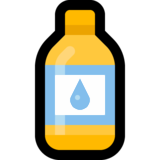

# Epoxy - A minimum MVVM assister library. 



[English language is here](https://github.com/kekyo/Epoxy)

[](https://www.repostatus.org/#wip)

|Package|Status|
|:--|:--|
|Epoxy.Wpf|[](https://www.nuget.org/packages/Epoxy.Wpf)|
|Epoxy.Xamarin.Forms|[](https://www.nuget.org/packages/Epoxy.Xamarin.Forms)|
|Epoxy.Uwp|[](https://www.nuget.org/packages/Epoxy.Uwp)|

## これは何?

* Epoxyは、.NET XAML環境で使える、Model-View-ViewModel (MVVM) アーキテクチャ向けの、シンプルで小さいライブラリです。
* 以下の環境をサポートしています:
  * WPF: .NET 5/.NET Core 3.0/3.1, .NET Framework 4.5/4.8
  * Xamarin Forms: .NET Standard 2.0
  * UWP: Universal Windows 10
* 非同期処理 (async-await) を安全に書くことが出来るように配慮しています。
* C# 8.0でサポートされた、null許容参照型を使えます。
* 理解しやすいAPIです。
* 大げさにならない、最小の手間とコストで Model-View-ViewModel 設計を実現します。
  * Viewにコードビハインドを書かずに済むことが着地点ですが、そのために煩雑な処理を記述しなければならなくなる事を避ける方針です。
  * MVVMビギナーが躓きそうな部分に焦点を当てています。
* 小さなライブラリです。
* ほかの MVVMフレームワーク(例: ReactiveProperty)と組み合わせて使えるように、余計な操作や暗黙の前提を排除しています。

## サンプルコード

WPFとXamarin Formsの実働サンプルがあります。
このサンプルは、Reddit掲示板のr/awwから、最新の投稿記事と画像を非同期でダウンロードしながら、
リスト形式で表示するものです。

* [EpoxyHello.Wpf](samples/EpoxyHello.Wpf).
* [EpoxyHello.Xamarin.Forms](samples/EpoxyHello.Xamarin.Forms).

起動後にボタンをクリックすると、完全に非同期でダウンロードしながら、リストに結果を追加していきます。


## MVVMアプリケーションの実装を、最小限の手間で始める

XAMLビューの定義とその実装を、MVVMに従って完全に分離しつつ、最小限の手間で実装する例です。

(このコードはWPFの例で、ポイントとなる点に絞っているため、完全な例はサンプルコードを参照して下さい):

```xml
<Window
    x:Class="EpoxyHello.Wpf.Views.MainWindow"
    xmlns="http://schemas.microsoft.com/winfx/2006/xaml/presentation"
    Title="EpoxyHello.Wpf" Height="450" Width="800">

    <!-- ここに、ViewModelクラスのインスタンスを配置します。この定義によって、IDEがViewModelの型を認識できます。 -->
    <Window.DataContext>
        <viewmodels:MainWindowViewModel />
    </Window.DataContext>
    
    <DockPanel>
        <!-- ボタンのクリックイベントを、ViewModel側にバインディングで通知します。 -->
        <Button DockPanel.Dock="Top" Height="30"
                Command="{Binding Fetch}">Asynchronous fetch r/aww from Reddit!</Button>
        <Grid>
            <!-- ListBoxに、ダウンロードした記事を保持するViewModelのコレクションをバインディングします。 -->
            <ListBox ItemsSource="{Binding Items}"
                ScrollViewer.HorizontalScrollBarVisibility="Disabled"
                ScrollViewer.VerticalScrollBarVisibility="Auto"
                ScrollViewer.CanContentScroll="False">
                <ListBox.ItemTemplate>
                    <DataTemplate>
                        <!-- ダウンロードした記事のイメージを表示します。 -->
                        <Image
                            Source="{Binding Image}"
                            Stretch="UniformToFill" />
                    </DataTemplate>
                </ListBox.ItemTemplate>
            </ListBox>
        </Grid>
    </DockPanel>
</Window>
```

完全に分離された、ViewModelクラスの実装です。
完全に、とは、つまりViewクラス[(MainWindow.xaml.cs)](samples/EpoxyHello.Wpf/Views/MainWindow.xaml.cs)に、コードビハインドを一切記述しないことを指します。

```csharp
// ステップ 1: ViewModelクラスを、 Epoxy.ViewModel から継承して作ります。
public sealed class MainWindowViewModel : ViewModel
{
    // ステップ 2: XAMLから参照したいプロパティを定義します。
    //    Epoxyは、 C# 8.0 で追加された、null許容参照型定義に対応しています。
    public Command? Fetch
    {
        // ステップ 2-1: 一般的な型であれば、GetValue(), SetValue()の引数に、
        //    プロパティ名を書いたり型キャストを書く必要はありません。
        get => this.GetValue();
        private set => this.SetValue(value);
    }

    public ObservableCollection<ImageSource>? Items
    {
        // ステップ 2-2: このように、複雑な型やジェネリック型の場合にのみ、
        //    GetValue()にジェネリック型引数を与える必要があります。
        get => this.GetValue<ObservableCollection<ImageSource>?>();
        private set => this.SetValue(value);
    }

    // ViewModelのコンストラクタ
    public MainWindowViewModel()
    {
        // ステップ 3: プロパティに定義したSetValue()が呼び出されると、
        //    PropertyChangedイベントが発生して、XAML側に変更が通知されます。
        this.Items = new ObservableCollection<ItemViewModel>();

        // ステップ 4: XAMLで定義したボタンがクリックされた時に、このラムダ式が呼び出されます。
        //   この式はもちろん async-await を使用した非同期処理で書くことが出来て、
        //   未処理の例外も正しく処理されます。
        this.Fetch = Command.Create(async () =>
        {
            var reddits = await Reddit.FetchNewPostsAsync("r/aww");

            this.Items.Clear();

            foreach (var reddit in reddits)
            {
                this.Items.Add(await Reddit.FetchImageAsync(reddit.Url));
            }
        });
    }
}
```

## その他の有用な機能

### ChildrenBinder

TODO:

[For example (In WPF XAML)](https://github.com/kekyo/Epoxy/blob/09a274bd2852cf8120347411d898aca414a16baa/samples/EpoxyHello.Wpf/Views/MainWindow.xaml#L71)

[For example (In WPF view model)](https://github.com/kekyo/Epoxy/blob/09a274bd2852cf8120347411d898aca414a16baa/samples/EpoxyHello.Wpf/ViewModels/MainWindowViewModel.cs#L119)

### Anchor/Pile

Anchor/Pileは、XAMLとViewModelをゆるく結合して、XAML側のコントロールの完全な操作を、一時的に可能にします。

MVVMアーキテクチャのレアケースにおいて、コントロールを直接操作したくなることがままあります。
しかし、厳密に分離されたViewとViewModelでは、コードビハインドを書かないことが前提となるため、このような連携が難しくなります。
また、オブジェクト参照の管理を誤るとメモリリークにつながり、かつ、その箇所を特定するのが難しくなります。

Anchor/Pileは、コントロールへの参照を一時的にレンタルすることによって、ViewとViewModelを分離しながら、
この問題を解決します。もちろん、レンタル中の処理は非同期処理対応です。

```csharp
// PileをViewModelに配置する
// (操作したいコントロールのXAMLにAnchorを配置して、バインディングします)
this.ButtonPile = Pile.Create<Button>();

// ...

// コントロールを操作したくなったら、Pileを通じて参照をレンタルする:
this.ButtonPile.ExecuteAsync(async button =>
{
    // モデルから情報を非同期で取得
    var color = await ServerAccessor.GetColorAsync();
    // コントロールに反映
    button.Background = Color.FromRgb(color.R, color.G, color.B);
});
```

[For example (In WPF XAML)](https://github.com/kekyo/Epoxy/blob/09a274bd2852cf8120347411d898aca414a16baa/samples/EpoxyHello.Wpf/Views/MainWindow.xaml#L39)

[For example (In WPF view model)](https://github.com/kekyo/Epoxy/blob/09a274bd2852cf8120347411d898aca414a16baa/samples/EpoxyHello.Wpf/ViewModels/MainWindowViewModel.cs#L74)

### UIThread

UIスレッドの取り扱いは、異なるプラットフォームにおいても重要な点です。
Epoxyでは[UIThreadクラス](https://github.com/kekyo/Epoxy/blob/09a274bd2852cf8120347411d898aca414a16baa/Epoxy/UIThread.cs#L29)で同じ操作が行えるようにしています。
このクラスを使うことで、UIの操作と非同期処理を簡単に組み合わせる事が出来ます。

```csharp
// 現在のスレッドがUIスレッドかどうか
Debug.Assert(UIThread.IsBound);

// ワーカースレッドで継続させる
var read = await httpStream.ReadAsync(...).ConfigureAwait(false);

// ここではワーカースレッドで処理
Console.WriteLine($"Read={read}");

// UIスレッドに切り替える
await UIThread.Bind();

// バインディングされたTextBlockに反映する
this.Log = $"Read={read}";
```

## License

Apache-v2
