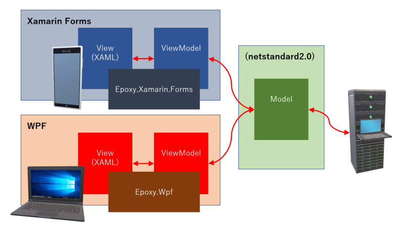

# Epoxy - An independent flexible XAML MVVM library


[](https://github.com/kekyo/Epoxy/blob/main/README.ja.md)

[](https://www.repostatus.org/#wip)

|Package|All (C#)|Description|
|:--|:--|:--|
|Epoxy.Wpf|[](https://www.nuget.org/packages/Epoxy.Wpf)|WPF version|
|Epoxy.Xamarin.Forms|[](https://www.nuget.org/packages/Epoxy.Xamarin.Forms)|Xamarin Forms version|
|Epoxy.Avalonia|[](https://www.nuget.org/packages/Epoxy.Avalonia)|Avalonia version|
|Epoxy.Uwp|[](https://www.nuget.org/packages/Epoxy.Uwp)|Universal Windows version|
|Epoxy.WinUI|[](https://www.nuget.org/packages/Epoxy.WinUI)|WinUI 3 version (Broken?)|
|Epoxy.Uno|[](https://www.nuget.org/packages/Epoxy.Uno)|Uno platform version (**BUGGY**)|

|Package|F# specialized|Description|
|:--|:--|:--|
|FSharp.Epoxy.Wpf|[](https://www.nuget.org/packages/FSharp.Epoxy.Wpf)|WPF version|
|FSharp.Epoxy.Avalonia|[](https://www.nuget.org/packages/FSharp.Epoxy.Avalonia)|Avalonia version|

|Package|All|Description|
|:--|:--|:--|
|Epoxy.Templates|[](https://www.nuget.org/packages/Epoxy.Templates)|dotnet CLI template package|

## What is this ?

* Epoxy is a .NET XAML Model-View-ViewModel data-bindable infrastructure library, independent flexible API sets.
  * All .NET languages including C#, and specialized F# NuGet packages are available.
* Supported platforms:
  * WPF: .NET 5/.NET Core 3.0/3.1, .NET Framework 4.5/4.8
  * Xamarin Forms: [Xamarin Forms](https://github.com/xamarin/Xamarin.Forms) (4.8.0.1821)
  * Avalonia: [Avalonia](https://avaloniaui.net/) (0.10.0)
  * Universal Windows: Universal Windows 10 (Fall creators update 10.0.16299 or higher)
  * WinUI: [WinUI 3 preview 4](https://docs.microsoft.com/en-us/windows/apps/winui/winui3/) (windows3.0.0-preview4.210210.4, 10.0.17134.0 or upper), [But may cause executing error same as this issue.](https://github.com/microsoft/microsoft-ui-xaml/issues/4226)
  * Uno: [Uno platform](https://platform.uno/) (uap10.0.17763, netstandard2.0[wpf, wasm, tizen], xamarinios10, xamarinmac20 and monoandroid10.0) / **Uno is not a stable, so we can only confirm it on UWP hosts**
* Safe asynchronous operation (async-await) ready.
* C# 8.0 nullable reference types ready.
* F# is 5.0 compatible, F# signatures (camel-case functions, function types, `Async` type assumptions) are defined.
* Smallest footprint and easy understandable.
  * No dependency on non-platform standard frameworks or libraries.
* Supported simplest and minimalism Model-View-ViewModel design.
  * The main goal is to avoid writing code behinds in the View, but to avoid having to write complicated processes to do so.
  * The focus is on areas where MVVM beginners might stumble.
  * We don't do complete commonality; only Epoxy has a common structure as much as possible, and other parts are dependent on each environment to avoid being the greatest common divisor.
  * Each function is "unrelated" to each other. Since they are independent, they can be freely combined.
* Friction-free for combination other framework libraries such as ReactiveProperty and etc.

## Sample code

You can refer multi-platform application sample code variation in.
This sample displays a list of the latest posts and images from the Reddit forum r/aww, downloading them asynchronously and displays them in a list format.

### How to get and build the sample code

The .NET CLI template is supported. You can easily try the sample code in a clean state with the following command:

```bash
# Install the template package (you only need to do it once)
dotnet new -i Epoxy.Templates

# Extract the WPF sample code to the current directory.
dotnet new epoxy-wpf

# Build
dotnet build
```

### List of currently supported templates

|`dotnet new` parameter|Language|Target|
|:--|:--|:--|
|`epoxy-wpf`|C#, F#|Sample code for WPF|
|`epoxy-uwp`|C#|Sample code for UWP|
|`epoxy-xamarin-forms`|C#|Sample code for Xamarin Forms|
|`epoxy-avalonia`|C#, F#|Sample code for Avalonia|
|`epoxy-winui`|C#|Sample code for WinUI|

* By default, the C# sample code is extracted; to change to F#, add option into command line like: `dotnet new epoxy-wpf -lang F#`.
* Currently, WinUI may not work properly due to preview version limitation.
* We do not have a template for Uno platform yet.

### Detail for sample code

Full asynchronous fetching and updating into ListBox when you click a button.


----

## Getting started minimum MVVM application

Review of Model-View-ViewModel architecture:

* `View`: Describes the user interface in XAML and write binding expressions to the `ViewModel` (without writing code-behinds).
* `ViewModel`: Get information from `Model` and define properties that map to `View`.
* `Model`: Implement processes that are not directly related to the user interface. In this case, the process of downloading posts from Reddit.

The relationship between these MVVM elements is illustrated in the following figure:



NOTE: There are many theories about the architecture of MVVM.
It is a good idea to brush up on the design without aiming for perfection from the start.
Epoxy is designed to be improved step by step.

Completed separately xaml based view declarations.
(WPF, introducing focused, refer full sample code instead):

### Example of View (WPF/XAML) implementation

```xml
<Window
    x:Class="EpoxyHello.Wpf.Views.MainWindow"
    xmlns="http://schemas.microsoft.com/winfx/2006/xaml/presentation"
    viewmodels="clr-namespace:EpoxyHello.Wpf.ViewModels"
    Title="EpoxyHello.Wpf" Height="450" Width="800">

    <!-- Place view model instance, it'll verify types (by IDE)  -->
    <Window.DataContext>
        <viewmodels:MainWindowViewModel />
    </Window.DataContext>
    
    <DockPanel>
        <!-- Binding button click event. -->
        <Button DockPanel.Dock="Top" Height="30"
                Command="{Binding Fetch}">Asynchronous fetch r/aww from Reddit!</Button>
        <Grid>
            <!-- Binding an image collection. -->
            <ListBox ItemsSource="{Binding Items}"
                ScrollViewer.HorizontalScrollBarVisibility="Disabled"
                ScrollViewer.VerticalScrollBarVisibility="Auto"
                ScrollViewer.CanContentScroll="False">
                <ListBox.ItemTemplate>
                    <DataTemplate>
                        <!-- Binding an image. -->
                        <Image
                            Source="{Binding Image}"
                            Stretch="UniformToFill" />
                    </DataTemplate>
                </ListBox.ItemTemplate>
            </ListBox>
        </Grid>
    </DockPanel>
</Window>
```

### Example of ViewModel (WPF) implementation

Completed separately `ViewModel` implementation.

```csharp
// Step 1: Write view model class deriving from Epoxy.ViewModel.
public sealed class MainWindowViewModel : ViewModel
{
    // Step 2: Expose properties to view.
    //    Epoxy can handle with C# 8.0's nullable reference types.
    public Command? Fetch
    {
        get => this.GetValue();
        private set => this.SetValue(value);
    }

    public ObservableCollection<ImageSource>? Items
    {
        // Step 2-1: Can suppress the GetValue() generic argument
        //   if use basic types (primitives, string, Command and etc).
        get => this.GetValue<ObservableCollection<ImageSource>?>();
        private set => this.SetValue(value);
    }

    public MainWindowViewModel()
    {
        // Step 3: Property setter will raise PropertyChanged events if value is changed.
        this.Items = new ObservableCollection<ItemViewModel>();

        // Step 4: A handler for fetch button.
        //   Ofcourse, we can use async/await safely in lambda expressions!
        this.Fetch = CommandFactory.Create(async () =>
        {
            var reddits = await Reddit.FetchNewPostsAsync("r/aww");

            this.Items.Clear();

            foreach (var reddit in reddits)
            {
                var bitmap = new WriteableBitmap(
                    BitmapFrame.Create(new MemoryStream(await Reddit.FetchImageAsync(url))));
                bitmap.Freeze();
                this.Items.Add(bitmap);
            }
        });
    }
}
```

### Example of Model implementation

The common code to access Reddit is implemented in the `EpoxyHello.Core` project.
It does not depend on either WPF, Xamarin Forms, Uno and UWP assemblies and is completely independent.

By eliminating dependencies in this way, we can achieve commonality for multi-platform support.
However, for small-scale development, you can place the `Model` implementation in the same project as the `ViewModel` implementation
(separating them eliminates the possibility of unintentional dependencies).

[Image downloader from Reddit post (EpoxyHello.Core)](https://github.com/kekyo/Epoxy/blob/1b16a9e447876a5e109166c7c5f5902a1dc52947/samples/EpoxyHello.Core/Models/Reddit.cs#L63):

```csharp
// Model implementation: The pure netstandard2.0 library.
// Downalod image data from Reddit.
public static async ValueTask<byte[]> FetchImageAsync(Uri url)
{
    using (var response =
        await httpClient.GetAsync(url).ConfigureAwait(false))
    {
        using (var stream =
            await response.Content.ReadAsStreamAsync().ConfigureAwait(false))
        {
            var ms = new MemoryStream();
            await stream.CopyToAsync(ms).ConfigureAwait(false);
            return ms.ToArray();
        }
    }
}
```

Since the Model implementation does not directly manipulate the user interface fragments,
it can isolate task contexts with `task.ConfigureAwait(false)` annotation to improve performance.

### About ViewModel base class

`ViewModel` base class provides an implementation of the `GetValue`/`SetValue` methods.
These methods automatically notify to the XAML control by property changes event `NotifyPropertyChanging`/`NotifyPropertyChanged`.
For example, when a property is changed upon a button click in `ViewModel`, the change will be notified to the XAML control and reflected to the user interface.

As commented in the sample code above, the type argument may be omitted for `GetValue`.
See [definition of implicit operator](https://github.com/kekyo/Epoxy/blob/1b16a9e447876a5e109166c7c5f5902a1dc52947/Epoxy/ValueHolder.cs#L61) for the optional types.

In addition, `GetValue` defines the default value,
and `SetValue` defines an overload that can perform additional operations when the value is changed.

---

## Minor but useful features

Since each function is independent, it can be used in any combination.
(For example, it is NOT necessary to inherit from `ViewModel` to use it.)

### EventBinder

`EventBinder` allows binding of unbindable events as `Command` when they are exposed.
This feature avoids the practice of writing a code-behind for the sake of writing an event handler.

For example, you can bind the `Window.Loaded` event of WPF as follows:

```xml
<!-- Declared Epoxy namespace -->
<Window xmlns:epoxy="https://github.com/kekyo/Epoxy">

    <!-- ... -->

    <epoxy:EventBinder.Events>
        <!-- Binding the Window.Loaded event to the ViewModel's Ready property -->
        <epoxy:Event Name="Loaded" Command="{Binding Ready}" />
    </epoxy:EventBinder.Events>
</Window>
```

On the `ViewModel` side, you can write handlers in Command, just like Button:

```csharp
// Defining the Command property for receiving Loaded events
public Command? Ready
{
    get => this.GetValue();
    private set => this.SetValue(value);
}

// ...

// Describe what to do when the Loaded event occurs.
this.Ready = CommandFactory.Create<EventArgs>(async _ =>
{
    // ex: Asynchronous acquisition of information to be displayed in the list from Model.
    foreach (var item in await Model.FetchInitialItemsAsync())
    {
        this.Items.Add(item);
    }
});
```

The generic argument of `CommandFactory.Create<T>` is the second argument of the event (usually a class that inherits from EventArgs).
Currently, this type must be specified because of strict checking.
However, if you do not use the argument, or if you know it is not important,
you can use `EventArgs` uniformly, as in the example above.

TIP 1: In WPF, UWP, and Xamarin Forms, you can use `Behavior` and `Trigger` to achieve the same thing.
However, WPF and UWP require additional packages and are designed to be generic,
so they are a bit more complex.
Using `EventBinder` has the advantage of being simple and using the same notation.

TIP 2: In a UWP environment (including UWP builds of Uno), the target event should have the following signature:

```csharp
// Events that can be bound by EventBinder
public event RoutedEventHandler Loaded;
```

In other words, only events published with the RoutedEventHandler type are eligible.
The UWP runtime environment has strict security checks.
This is because the UWP runtime environment has strict security checks, and there are restrictions when dynamically hooking events.

* [For example (In WPF XAML)](https://github.com/kekyo/Epoxy/blob/21d16d00311f9379f0e0d431bcd856594b446cf0/samples/EpoxyHello.Wpf/Views/MainWindow.xaml#L36)
* [For example (In WPF view model)](https://github.com/kekyo/Epoxy/blob/21d16d00311f9379f0e0d431bcd856594b446cf0/samples/EpoxyHello.Wpf/ViewModels/MainWindowViewModel.cs#L45)
* [For example (In Xamarin Forms XAML)](https://github.com/kekyo/Epoxy/blob/21d16d00311f9379f0e0d431bcd856594b446cf0/samples/EpoxyHello.Xamarin.Forms/EpoxyHello.Xamarin.Forms/Views/MainPage.xaml#L33)
* [For example (In Xamarin Forms view model)](https://github.com/kekyo/Epoxy/blob/21d16d00311f9379f0e0d431bcd856594b446cf0/samples/EpoxyHello.Xamarin.Forms/EpoxyHello.Xamarin.Forms/ViewModels/MainContentPageViewModel.cs#L40)

### Anchor/Pile

`Anchor`/`Pile` pair is a loose connection between `UIElement` (Xamarin Forms `Element`) and `ViewModel`s.

Rare case in MVVM architecture, we have to access directly `UIElement` member,
but sometimes gointg to wait the pitfall of circular references (and couldn't unbind by GC).

The `Pile` pull in the `UIElement`'s anchor, and we can rent temporary `UIElement` reference safely inside `ViewModel`.

```xml
<!-- Declared Epoxy namespace -->
<Window xmlns:epoxy="https://github.com/kekyo/Epoxy">

    <!-- ... -->

    <!-- Placed Anchor onto the TextBox and bound property -->
    <TextBox epoxy:Anchor.Pile="{Binding LogPile}" />
</Window>
```

```csharp
// Declared a Pile into the ViewModel.
this.LogPile = Pile.Create<TextBox>();

// ...

// Do rent by Pile when we have to manipulate the TextBox directly:
await this.LogPile.ExecuteAsync(async textBox =>
{
    // Fetch information from related model.
    var result = await ServerAccessor.GetResultTextAsync();
    // We can manipulate safer directly TextBox.
    textBox.AppendText(result);
});
```

* [For example (In WPF XAML)](https://github.com/kekyo/Epoxy/blob/09a274bd2852cf8120347411d898aca414a16baa/samples/EpoxyHello.Wpf/Views/MainWindow.xaml#L39)
* [For example (In WPF view model)](https://github.com/kekyo/Epoxy/blob/09a274bd2852cf8120347411d898aca414a16baa/samples/EpoxyHello.Wpf/ViewModels/MainWindowViewModel.cs#L74)

### ValueConverter

`ValueConverter` class is a base class for safely implementing the XAML converters.
It avoids cumbersome typecasting by explicitly specifying the type, and
It can also automatically fail to convert incompatible types.

You can give an argument to the converter with `ConverterParameter` on the XAML,
then you have to change the base class to use when you receive this parameter or not.

```csharp
// This is an implementation of a converter that takes an integer and converts it to a Brush.
// Specify the expected type as a generic argument.
public sealed class ScoreToBrushConverter : ValueConverter<int, Brush>
{
    // When the need for conversion arises, TryConvert will be called.
    public override bool TryConvert(int from, out Brush result)
    {
        // The result of the conversion is returned by the out argument.
        result = from >= 5 ? Brush.Red : Brush.White;
        // If the conversion fails, you have to return false.
        return true;
    }

    // Although not shown here as an example, TryConvertBack can also be implemented.
}
```

This is an example of receiving a converter parameter:

```csharp
// In this example, it receives the value specified by ConverterParameter.
// Its type is specified by the generic second argument.
// Here is an example of receiving a string:
public sealed class ScoreToBrushConverter : ValueConverter<int, string, Brush>
{
    // The value of the parameter is passed as the second argument.
    public override bool TryConvert(int from, string parameter, out Brush result)
    {
        // ...
    }
}
```

Note: The XAML converter cannot be asynchronous due to the structure of XAML.
This means that the `TryConvert` method cannot be made to behave like `TryConvertAsync`.

Try not to do asynchronous processing in the XAML converter!
(If you want to do so, you can implement it on the `Model` or `ViewModel` side to avoid problems such as deadlocks).

* [For example](https://github.com/kekyo/Epoxy/blob/09a274bd2852cf8120347411d898aca414a16baa/samples/EpoxyHello.Wpf/Views/Converters/ScoreToBrushConverter.cs#L25)

### UIThread

Some different platform contains different UI thread manipulation.
Epoxy can handle only one [UIThread class](https://github.com/kekyo/Epoxy/blob/09a274bd2852cf8120347411d898aca414a16baa/Epoxy/UIThread.cs#L29),
it has commonly manipulation methods.
We can easier combine both UI manipulation and asynchronous operations.

```csharp
// Can check what current thread
Debug.Assert(UIThread.IsBound);

// Invoke asynchronous operation and will detach current thread context.
var read = await httpStream.ReadAsync(...).ConfigureAwait(false);

// Executes on the worker thread.
Console.WriteLine($"Read={read}");

// Switches to the UI thread explicitly.
await UIThread.Bind();

// We can handle any UI elements in the UI thread (include binding operation.)
this.Log = $"Read={read}";
```

#### Note on running in a UWP environment

In the current implementation, if you use the `UIThread` class,
in the constructor of a `ViewModel` while building a `View` and like,
inside a UWP environment such as UWP native, Xamarin Forms/Uno, or a UWP-derived runtime such as WinUI,
you may not get the correct results.

UWP has a different UI thread assigned to each window that holds a view,
and if you use it while constructing an instance,
it will not be able to determine the view correctly.

### ChildrenBinder

TODO:

* [For example (In WPF XAML)](https://github.com/kekyo/Epoxy/blob/09a274bd2852cf8120347411d898aca414a16baa/samples/EpoxyHello.Wpf/Views/MainWindow.xaml#L71)
* [For example (In WPF view model)](https://github.com/kekyo/Epoxy/blob/09a274bd2852cf8120347411d898aca414a16baa/samples/EpoxyHello.Wpf/ViewModels/MainWindowViewModel.cs#L119)

### GlobalService (Advanced topic)

`GlobalService` class is an Epoxy implementation of techniques
such as dependency injection and dependency isolation.
Like other functions, it can safely implement asynchronous processing.

The key of dependency separation is to define a common interface type:

```csharp
// Commonly Sample.Xamarin.Forms project.

// Define platform-independent Bluetooth operations,
// applying the GlobalService attribute.
[GlobalService]
public interface IBluetoothAccessor
{
    // Start discovering Bluetooth.
    ValueTask BeginDiscoverAsync();
}
```

Then, in each platform's project, register the implementation of this interface.
The following is an example for Android:

```csharp
// In Sample.Xamarin.Forms.Android project:

// Implementation for Android Bluetooth.
public sealed class AndroidBluetoothAccessor : IBluetoothAccessor
{
    public async ValueTask BeginDiscoverAsync()
    {
        // Android-specific implementation...
    }
}

// The Application constructor
public Application()
{
    // Register a class instance that performs Android-dependent processing.
    GlobalService.Register(new AndroidBluetoothAccessor());
}
```

Now you can use separate implementations through interfaces in a common project:

```csharp
// Commonly Sample.Xamarin.Forms project.

// I want to use Bluetooth:
await GlobalService.ExecuteAsync<IBluetoothAccessor>(async accessor =>
{
    // Start discovering Bluetooth.
    await accessor.BeginDiscoverAsync();

    // ...
});

```

Existing libraries for dependency injection and dependency isolation
(e.g. `DependencyService` class, Unity, MEF, etc.) have the following problems:

* Have complex functionality: In many situations, you simply want an instance that implements
a common interface, so the `GlobalService` class allows you to perform such operations in a fast way.
* If the retrieved instance is retained, it is not possible to manage the lifetime:
Since it is fast, it is not a problem to call `ExecuteAsync` every time.
Rather, it is preferable to use it only when necessary, each time.

NOTE: As the name "Global" implies, `GlobalService` behaves like a kind of global variable.
Try not to use `GlobalService` in places where it is not really needed.
`Epoxy.Advanced` namespace (using declarations are required) to make it a bit more distinguishable.

---

## About the F# version

By using the F# version of the package, you can write code that follows the F# style as follows.
The instances used are shared, you can use the preferred API for both C# and F# while maintaining the same instances.

### camel-case function names

All functions in FSharp.Epoxy are camel-cased. For example, instead of the `GetValue`/`SetValue` methods in the `ViewModel` base class, use the `getValue`/`setValue` functions.

```fsharp
open Epoxy
type ItemViewModel() =
    inherit ViewModel()

    // Use the getValue and setValue functions to transfer properties.
    // You can write the type where type inference is effective,
    // so get() and set() can be written with type annotations.
    member __.Title
        with get(): string = __.getValue()
        and set (value: string) = __.setValue value
```

### Direct support for F# types

Function types instead of delegate types, and `Option` types instead of out parameters, to make it easier for F# to handle them.

```fsharp
// Arguments that receive a delegate can directly receive
// F# function type instead.
self.Ready <- Command.Factory.createSync(fun (e:RoutedEventArgs) ->
    self.IsEnabled <- true)
```

```fsharp
type public ScoreToBrushConverter() =
    inherit ValueConverter<int, Brush>()

    // The convert function has no out parameter and
    // can be written to return the 'T option.
    override __.convert from =
        if from >= 5 then Some yellow else Some gray
```

### Use the type `Async` instead of `ValueTask` as the default asynchronous type

Basically, all asynchronous operations are designed to be described smoothly with the type `Async`.

```fsharp
// Since the default function definitions are all defined to
// accept F#'s `Async` type, so we can use asynchronous workflows
// with `async { ... }`.
self.Fetch <- CommandFactory.create(fun () -> async {
    let! reddits = Reddit.fetchNewPostsAsync "r/aww"
    // ...
})
```

When used in conjunction with my other project [FusionTasks](https://github.com/kekyo/FSharp.Control.FusionTasks), it makes easier to work with existing libraries that use `Task`/`ValueTask` (such as `HttpClient.GetAsync`). dotnet CLI templates are enabled by default.

`Epoxy.Supplements` namespace should be explicitly imported when directly passing methods that return `Task` or `ValueTask` types, or when providing computation expressions that constitute these types.

NOTE: The preference for the `Async` type may change when [the `resumable` structure is released in a future F# release.](https://github.com/dotnet/fsharp/pull/6811)

### Automatic resourceization of WPF XAML pages

So the XAML build action is automatically changed so that it is added to the project as a resource. When you add the XAML file to the project, you don't need to do anything in particular to set it up correctly.

One limitation of this feature is that XAML is always stored in the resource as raw source code (XML text) and is not converted to binary (BAML). Also, the assembly name must always be specified in the XAML namespace in order to be able to reference the type at runtime:

```xml
<!-- Always add the assembly directive to the clr-namespace directive -->
<Window
    xmlns="http://schemas.microsoft.com/winfx/2006/xaml/presentation"
    xmlns:viewmodels="clr-namespace:EpoxyHello.ViewModels;assembly=EpoxyHello"
    Title="EpoxyHello" Height="450" Width="800">

    <Window.DataContext>
        <viewmodels:MainWindowViewModel />
    </Window.DataContext>

    <!-- ... -->
</Window>
```

---

## License

Apache-v2

## History

* 0.15.0:
  * Added F#'s camel-casing UIThread API.
  * Made safer handler for catching excedptions on Command infrastructure.
* 0.14.0:
  * Added XamlDesigner class.
  * Added Avalonia runtime platforms on net48, netcoreapp2.1, netcoreapp3.1 and net5.0.
  * Added F#'s camel-casing API entry points.
  * Downgraded FSharp.Core version from 5.0.1 to 5.0.0.
  * Fixed runnable view model on Avalonia XAML design time.
  * Fixed failure editing on Avalonia C# XAML designer.
* 0.13.0:
  * Added dotnet CLI templates.
  * Improved UIThread detection on WinUI platform.
  * In F# WPF NuGet package, it will place XAML code into assembly resource automatically.
* 0.11.0:
  * Added F# support.
  * Swapped ValueConverter generic arguments. (Breaking)
  * Moved some factory methods into "Factory" marked types. (Breaking)
* 0.10.0:
  * Supported WinUI platform.
* 0.9.0:
  * Supported Uno platform and Avalonia.
* 0.8.0:
  * Added GlobalService and EventBinder features.
* 0.7.0:
  * Added Xamarin Forms sample code.
* 0.6.0:
  * Split synchronous Command handler.
* 0.5.0:
  * Added UIThread and Anchor/Pile features.
